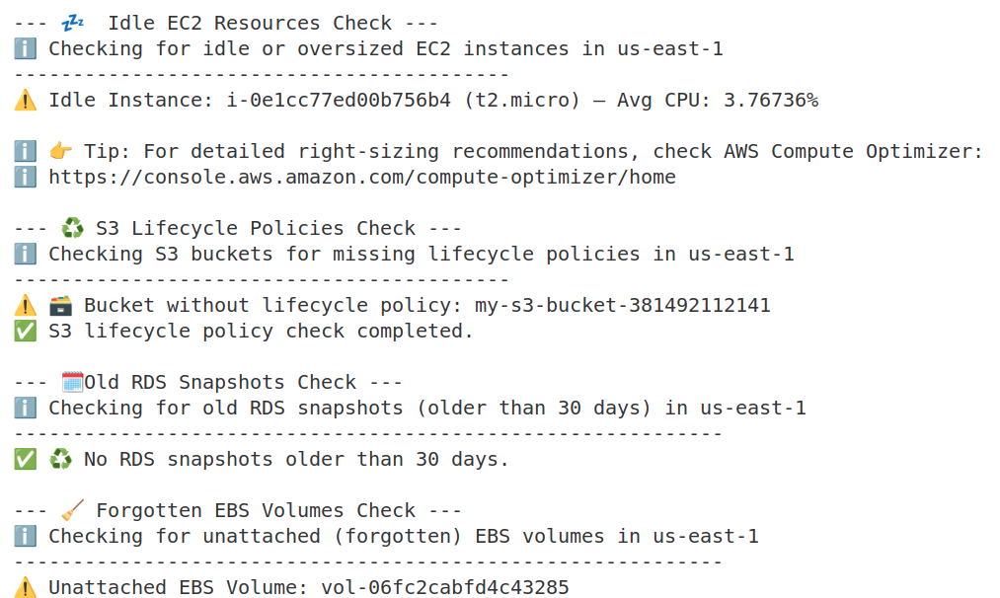

# AWS Cost Audit

The following scripts allows to audit and review the following aspects of AWS Costs:
- **Untagged resources**: No tags = no visibility
-  **Idle EC2s & oversized instances**: Avoid wasted budget, downsize or right-size using [AWS Compute Optimizer](https://aws.amazon.com/compute-optimizer/)
- **No budgets or alerts**: Avoid surprises during high traffic spikes. Check budgets and alerts
- **S3 buckets with no lifecycle policies**: Without auto-delete rules, logs can pile up for years in your S3 buckets. To avoid set expiration policies 
- **Piling RDS Snapshots**: Old snapshots = hidden costs. Keep only what you need for compliance or recovery
- **Forgotten EBS volumes**: Unattached EBS volumes are still billed - unless they’re deleted or snapshotted and archived
- **Data Transfer Charges**: Cross-AZ traffic or public IP usage can sneak up. Use VPC endpoints and same-AZ designs where possible.
- **Savings Plans / Reserved Instances**: Using On-Demand Instances for stable workloads can result in overpaying. Review your workloads to migrate to savings plans.
- **Load balancers without traffic**: Check CloudWatch - if no traffic, shut them down.

## Run AWS Audit

To run the audit script:
```bash
./main.sh
```

You should get the output `audit_log` file and the check progress in the terminal:



> ⚠️ **Important:**  
> The scripts check only for one given account in one specific region. You should have to run it against other accounts and regions in separate

## Scripts

The `main.sh` script is the launcing script. `utils.sh` script defines AWS account ID and log message formats.

```bash
.
├── check_budgets.sh
├── check_data_transfer_risks.sh
├── check_forgotten_ebs.sh
├── check_idle_ec2.sh
├── check_idle_load_balancers.sh
├── check_old_rds_snapshots.sh
├── check_on_demand_instances.sh
├── check_s3_lifecycle.sh
├── check_untagged_resources.sh
├── main.sh
└── utils.sh
```

## AWS Budgets

The `check_budgets` script queries AWS for a list of budget names. For each budget, checks if notifications are set up and logs appropriate messages. For more information, see [AWS Budgets](https://aws.amazon.com/aws-cost-management/aws-budgets/)

## IDLE EC2 and Oversized Instances

The `check_idle_ec2.sh` script:
1. Queries all running EC2 instances.
2. For each instance, retrieves its type and calculates the average CPU utilization.
3. Flags instances as "idle" if their CPU usage is below 10%, or "active" otherwise.
4. Logs results using custom logging functions and suggests using AWS Compute Optimizer for further optimization.

## Check S3 Buckets Without Lifecycle Policies

In order to make this script function properly, first ensure that you have the following IAM permissions in your AWS account:
- `s3:ListAllMyBuckets`
- `s3:GetBucketLifecycleConfiguration`

The `check_s3_lifecycle.sh` script:
- Lists all S3 buckets in the account.
- For each bucket, checks if a lifecycle policy exists and logs the result.
- If a policy exists, displays details (ID, Prefix, Status) of each rule using `jq`.

## Check Old RDS Snapshots

In order to make this script function properly, first ensure that you have the following IAM permissions in your AWS account:
- `rds:DescribeDBSnapshots`

The `check_old_rds_snapshots.sh` script checks for Amazon RDS automated and manual database snapshots older than 30 days:
- Defines a 30-day threshold for identifying old snapshots.
- Queries RDS snapshots older than the threshold, extracting their identifier, associated instance, creation time, and type.

## Check for Forgotten EBS Volumes

The `check_forgotten_ebs.sh` script checks for unattached (available) Amazon EBS volumes in a specified AWS region:
- Queries EBS volumes with a status of "available" (not attached to any EC2 instance), extracting their ID, size, creation time, and tags.

## Audit Data Transfer Risks

The `check_data_transfer_risks.sh` script checks for the following:
- EC2 instances with public IP addresses
- Unused Elastic IPs
- Subnets in different AZs
- S3 VPC endpoint
- DynamoDB VPC endpoint

To add additional services for VPC endpoints like RDS, modify the script. For more information, see [Access an AWS service using an interface VPC endpoint](https://docs.aws.amazon.com/vpc/latest/privatelink/create-interface-endpoint.html)

## On-Demand EC2 Instances

The `check_on_demand_instances.sh` script outputs the number of on-demand EC2 instances in the account. To save more, review your workloads and consider using Reserved Instances or Savings Plans. For more information, see [EC2 pricing](https://aws.amazon.com/ec2/pricing/) 

## Load Balancers Without Traffic

The `check_idle_load_balancers.sh` script detects load balancers without traffic:
- Lists all Application Load Balancers (ALB) and Network Load Balancers (NLB)
- Checks CloudWatch metrics (RequestCount for ALB, ActiveFlowCount or ProcessedBytes for NLB)
- Flags any with `0` average traffic over a recent period (e.g. past 3 days)
